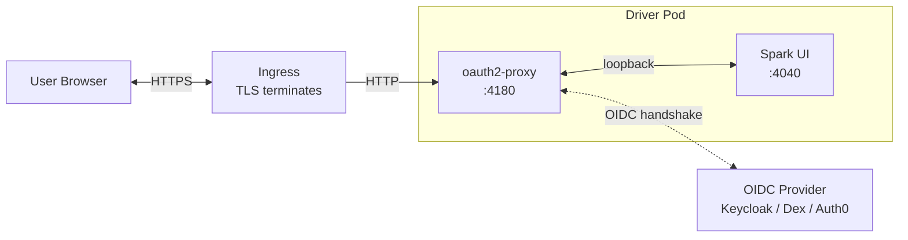

# OAuth2 Authentication for the Spark Driver UI

Technical documentation for the OAuth2-proxy integration that provides secure communication with the Spark UI when a spark job is submitted on Armada using **armada-spark** plugin.

## Audience

Developers and operators who need to set up, maintain, debug, or extend the OAuth integration in armada-spark.

## Quick Start

```bash
/opt/spark/bin/spark-submit \
  --master armada://localhost:50051 \
  --deploy-mode cluster \
  --name my-secure-job \
  --class org.apache.spark.examples.SparkPi \
  --conf spark.armada.container.image=armada-spark \
  --conf spark.armada.driver.ingress.enabled=true \
  --conf spark.armada.driver.ingress.tls.enabled=true \
  --conf spark.armada.driver.ingress.certName=my-tls-cert \
  --conf spark.armada.oauth.enabled=true \
  --conf spark.armada.oauth.clientId=spark-oauth-client \
  --conf spark.armada.oauth.clientSecret=your-secret \
  --conf spark.armada.oauth.issuerUrl=https://keycloak.example.com/realms/spark \
  local:///opt/spark/examples/jars/spark-examples.jar
```

What this gives you: an `oauth` sidecar container in the driver pod, an Ingress repointed at the proxy's listen port (4180 by default), and the Spark UI accessible at the Ingress URL only after a successful OIDC login. See [Configuration](configuration.md) for variations (K8s secrets, manual endpoints, cookie hardening).

## Contents


| Doc                                   | What's in it                                                                                                              |
| ------------------------------------- | ------------------------------------------------------------------------------------------------------------------------- |
| [Architecture](architecture.md)       | System architecture, component responsibilities, deployment view, design rationale.                                       |
| [Runtime Flow](runtime-flow.md)       | What actually happens at runtime: pod startup, the OIDC handshake, session management, token refresh, sequence diagrams.  |
| [Components](components.md)           | Deep dive into `OAuthSidecarBuilder`, every helper method, and the integration points in the submission pipeline.         |
| [Networking](networking.md)           | Service, Ingress, and container port wiring; the four integration points in `ArmadaClientApplication`; port truth tables. |
| [Configuration](configuration.md)     | All 35 `spark.armada.oauth.*` keys, grouped; mapping to oauth2-proxy CLI flags; worked examples.                          |
| [Troubleshooting](troubleshooting.md) | Common failure modes (502 after login, auth redirect loop) and how to find the Ingress URL.                               |


## TL;DR

When `spark.armada.oauth.enabled=true`, an `oauth2-proxy` container runs as a **native sidecar** (init container with `restartPolicy: Always`) inside the Spark driver pod. The pod's Ingress is repointed at the proxy's listen port (default 4180). The proxy authenticates browser users against an OIDC provider, maintains an encrypted session cookie, and reverse-proxies authenticated requests to the Spark UI on `127.0.0.1:4040`.




## Implementation provenance

Implemented via [PR #77](https://github.com/armadaproject/armada-spark/pull/77).

Core source files:

- [`OAuthSidecarBuilder.scala`](../../src/main/scala/org/apache/spark/deploy/armada/submit/OAuthSidecarBuilder.scala): sidecar container construction (358 lines, self-contained).
- [`ArmadaClientApplication.scala`](../../src/main/scala/org/apache/spark/deploy/armada/submit/ArmadaClientApplication.scala): integration points (`getEffectiveUIPort`, `buildDriverContainerPorts`, `buildServiceConfig`, `resolveIngressConfig`, and the call site at line 999).
- [`Config.scala`](../../src/main/scala/org/apache/spark/deploy/armada/Config.scala) (lines 477–710): all 35 `spark.armada.oauth.*` config entries.
- [`OAuthSidecarBuilderSuite.scala`](../../src/test/scala/org/apache/spark/deploy/armada/submit/OAuthSidecarBuilderSuite.scala): unit tests for the builder.

## Recommended reading order

1. **[Architecture](architecture.md)**: to get the lay of the land.
2. **[Runtime Flow](runtime-flow.md)**: to understand what actually happens when a user accesses the UI.
3. **[Networking](networking.md)**: to understand the port routing.
4. **[Components](components.md)**: to navigate the source.
5. **[Configuration](configuration.md)**: when you need to know what a key does.
6. **[Troubleshooting](troubleshooting.md)**: when something is failing and you need to find out why.

