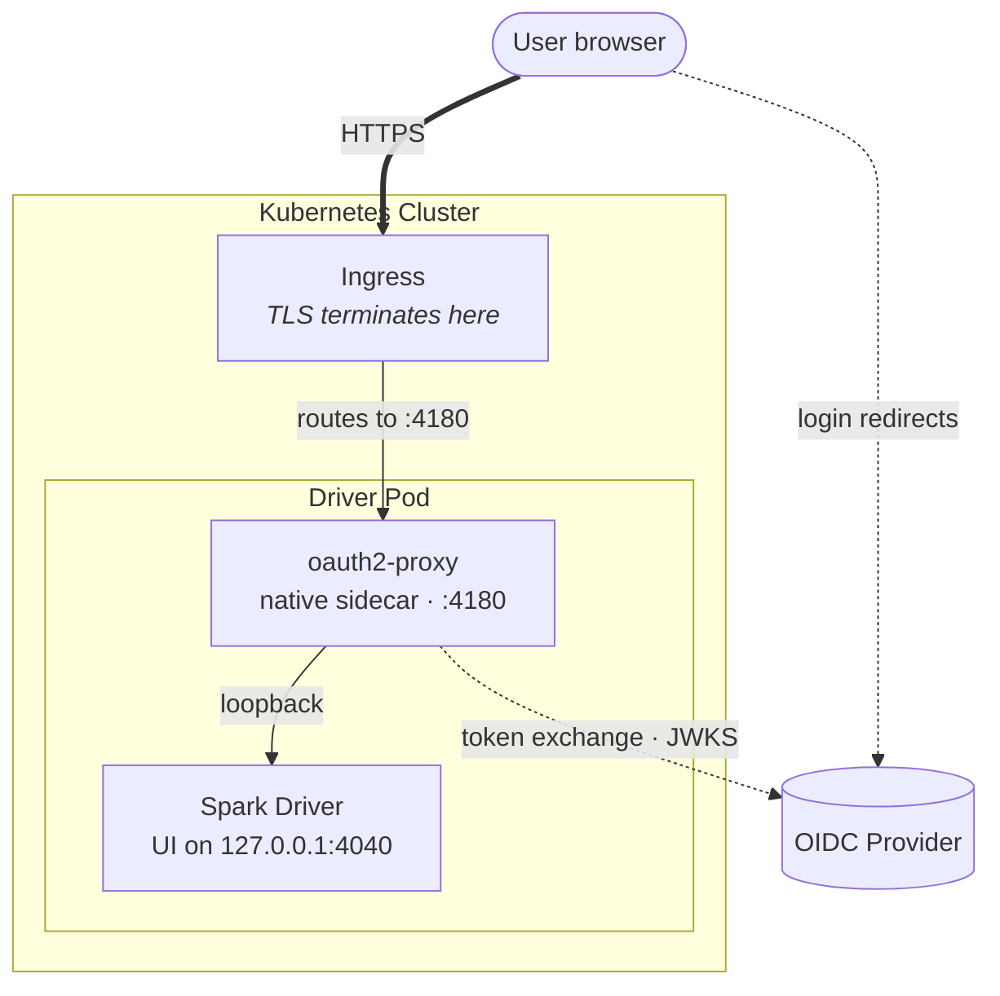

# Architecture

## System view

The OAuth integration adds a single sidecar container to the Spark driver pod and re-routes the Ingress so that all UI traffic passes through it.

The browser only ever sees the Ingress. oauth2-proxy is the only component that talks to the Spark UI directly, over loopback inside the same pod. The OIDC provider is reached by both the browser (during the redirect dance) and the proxy (for token exchange and JWKS lookups).

## Component responsibilities

The sidecar starts before the driver (native sidecar ordering) and terminates with the pod; there is no auth surface that outlives the driver.

### oauth2-proxy sidecar

A long-running init container with `restartPolicy: Always` (Kubernetes 1.28+ "native sidecar" pattern). It:

- Serves browser HTTP on `0.0.0.0:4180` (configurable via `spark.armada.oauth.proxy.port`).
- Drives the OIDC redirect dance (`/oauth2/start`, `/oauth2/callback`).
- Verifies the ID token signature against the provider's JWKS and checks `iss` / `aud` / `exp` / `email_verified`.
- Encrypts session state into a cookie and validates it on every subsequent request.
- Reverse-proxies authenticated requests to `http://127.0.0.1:<sparkUIPort>`.

### Spark driver container

Runs the Spark application. The Spark UI is part of the driver process (Jetty servlet on `spark.ui.port`, default 4040). When OAuth is enabled, the UI port is not added to the driver container's `ports` list; the proxy reaches it on `127.0.0.1`. Spark UI is fully OAuth-unaware.

### Headless Service

Created by Armada from the pod spec, exposing `driverPort` (typically 7078, used by executors via `service-0`) and the effective UI port (4180 with OAuth on, 4040 otherwise).

### Ingress

Created by Armada from the `IngressConfig` armada-spark builds in [`resolveIngressConfig`](../../src/main/scala/org/apache/spark/deploy/armada/submit/ArmadaClientApplication.scala). Backend port is the effective UI port. TLS, certificate, and annotations follow precedence **CLI > Job Template > Default**.

### OIDC provider (external)

Any OIDC-compliant provider. Either supply `issuerUrl` for discovery, or set explicit endpoints via `skipProviderDiscovery=true`.

## Constraints

- **Cluster-mode submission only.** OAuth applies to the driver pod, which only exists in cluster-mode.
- **Kubernetes 1.28+** for native sidecar semantics. Older versions treat `restartPolicy: Always` on an init container as a one-shot.
- **Ingress controller required** in the cluster.
- **OIDC provider reachable** from both the cluster (token exchange, JWKS) and the user's browser (authorize redirect).
