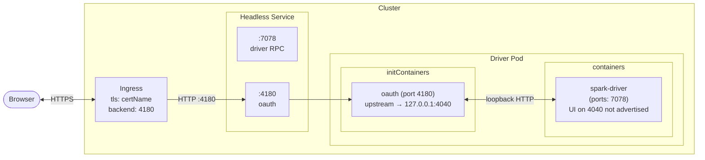

# Networking

Where ports go, how requests flow, and what changes when OAuth is enabled.

## The ports involved

| Port  | Owner          | Purpose                                                             | Visibility                       |
|-------|----------------|---------------------------------------------------------------------|----------------------------------|
| 4040  | Spark driver   | Spark UI (Jetty servlet, `spark.ui.port`)                           | Loopback only when OAuth on      |
| 4180  | oauth2-proxy   | Proxy listen port (`spark.armada.oauth.proxy.port`)                 | Exposed via Service+Ingress      |
| —     | Ingress        | Port for driver ingress (`spark.armada.driver.ingress.port`)        | Exposed via Service+Ingress      |
| 7078  | Spark driver   | Driver RPC port (executors connect here)                            | Service only (cluster-internal)  |
| 7079  | Spark driver   | Block manager port                                                  | Internal                         |

## Effective UI port

Three pieces of code (driver container `ports`, Service ports, Ingress backend) all derive their port from one helper in [`ArmadaClientApplication.scala`](../../src/main/scala/org/apache/spark/deploy/armada/submit/ArmadaClientApplication.scala):

```scala
private[submit] def getEffectiveUIPort(conf: SparkConf): Int =
  OAuthSidecarBuilder.getOAuthProxyPort(conf).getOrElse {
    conf.getInt("spark.ui.port", DEFAULT_SPARK_UI_PORT)
  }
```

OAuth on → proxy port (4180). OAuth off → Spark UI port (4040).

## Truth table

| Ingress | OAuth | Driver container ports | Service ports                       | Ingress backend |
|---------|-------|------------------------|--------------------------------------|-----------------|
| off     | off   | `[driver]`             | `[driver, 4040]`                     | (no Ingress)    |
| off     | on    | `[driver]`             | `[driver, 4180]` (proxy via sidecar) | (no Ingress)    |
| on      | off   | `[driver, ui]`         | `[driver, 4040]`                     | 4040            |
| on      | on    | `[driver]`             | `[driver, 4180]` (proxy via sidecar) | 4180            |

The driver container never declares the proxy port: Armada extracts native-sidecar ports automatically. When OAuth is on, the driver also drops the UI port; the proxy reaches it via loopback.

## Service shape

[`buildServiceConfig`](../../src/main/scala/org/apache/spark/deploy/armada/submit/ArmadaClientApplication.scala) builds a Headless Service so executors get stable DNS (`<service-name>-0.<service-name>.<ns>.svc`):

```scala
val uiPort = ArmadaClientApplication.getEffectiveUIPort(conf)
Seq(api.submit.ServiceConfig(
  `type` = api.submit.ServiceType.Headless,
  ports = Seq(driverPort, uiPort),
  name  = ""
))
```

Driver RPC is always first so executors can connect to `service-0`.

## Ingress shape

[`resolveIngressConfig`](../../src/main/scala/org/apache/spark/deploy/armada/submit/ArmadaClientApplication.scala):

```scala
val ingressPort = ArmadaClientApplication.getEffectiveUIPort(conf)
api.submit.IngressConfig(
  `type`       = api.submit.IngressType.Ingress,
  ports        = Seq(ingressPort),
  annotations  = templateIngress.map(_.annotations).getOrElse(Map.empty)
                  ++ cliIngress.map(_.annotations).getOrElse(Map.empty),
  tlsEnabled   = resolveValue(cliIngress.flatMap(_.tls), templateIngress.map(_.tlsEnabled), false),
  certName     = resolveValue(cliIngress.flatMap(_.certName), templateIngress.map(_.certName), ""),
  useClusterIP = true
)
```

Precedence for `tlsEnabled` and `certName`: **CLI > Job Template > Default**. Annotations are merged with CLI winning on key conflicts.

## Network flow (OAuth on)



## Ingress hostname

Armada generates the host as `<port-name>-<port>-armada-<job-id>-0.<namespace>.svc`:

- OAuth on: `oauth-4180-armada-<job-id>-0.<ns>.svc`
- OAuth off: `ui-4040-armada-<job-id>-0.<ns>.svc`

Find it via Lookout (Result tab) or `kubectl get ingress -n <namespace>`.

## TLS termination

TLS terminates at the Ingress when `spark.armada.driver.ingress.tls.enabled=true` and `spark.armada.driver.ingress.certName` references a valid TLS secret. Inside the cluster, traffic from Ingress to proxy and from proxy to Spark UI is plain HTTP. Setting `cookieSecure=true` on oauth2-proxy adds the `Secure` attribute to the Set-Cookie header so browsers only send the cookie over HTTPS; the in-cluster hop is unaffected.

End-to-end TLS (Ingress and proxy both on TLS) is possible via `--tls-cert-file` / `--tls-key-file`, but the builder does not surface these as Spark config keys.
