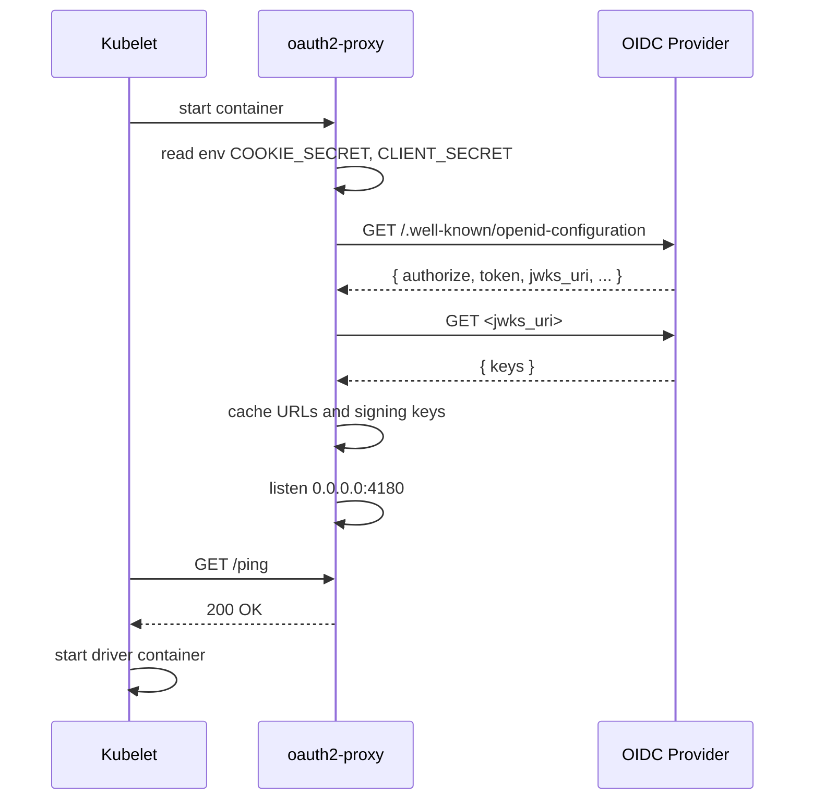
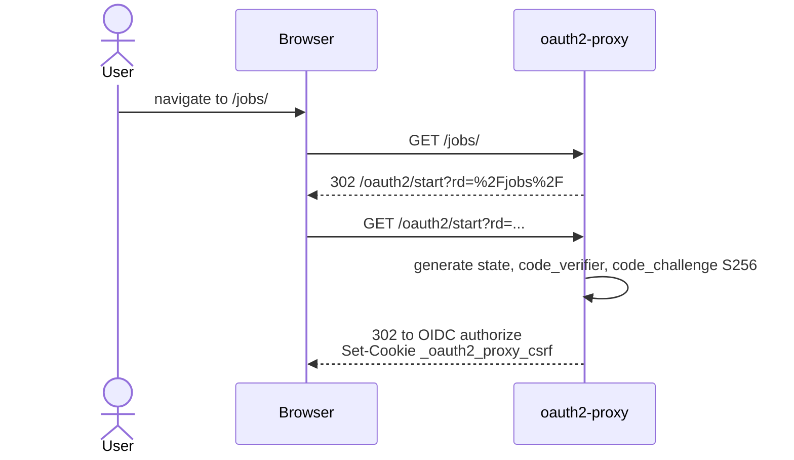
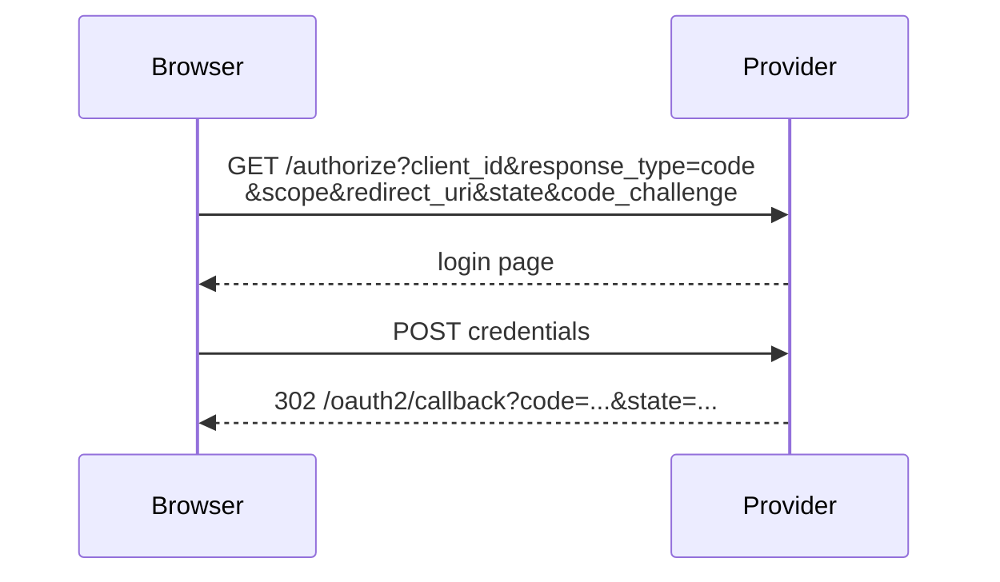
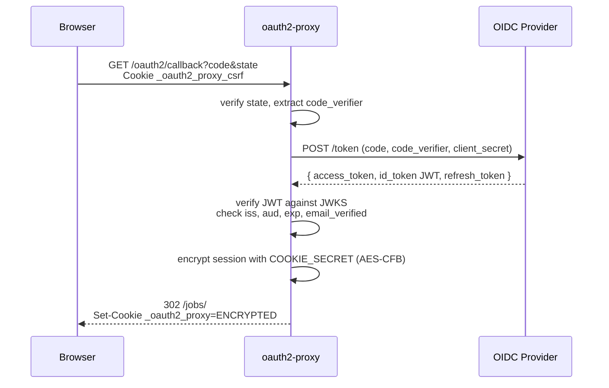
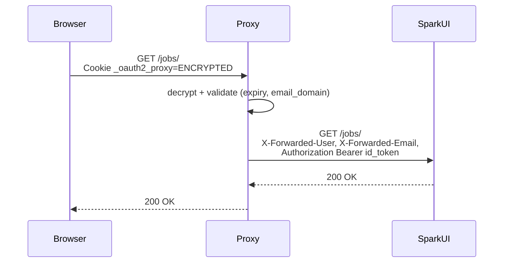
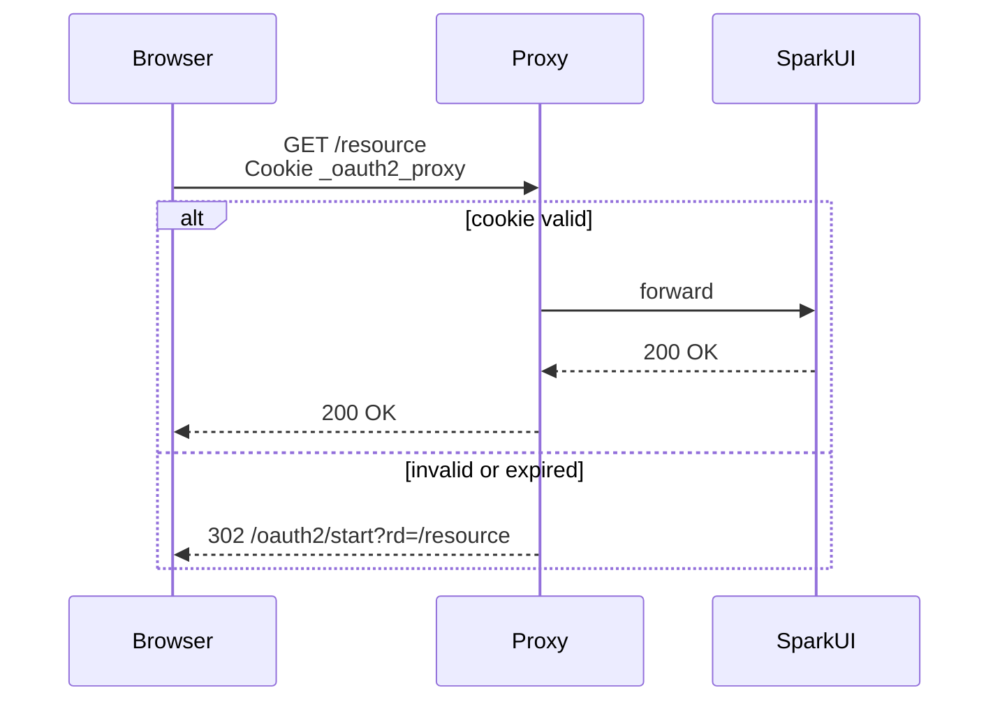
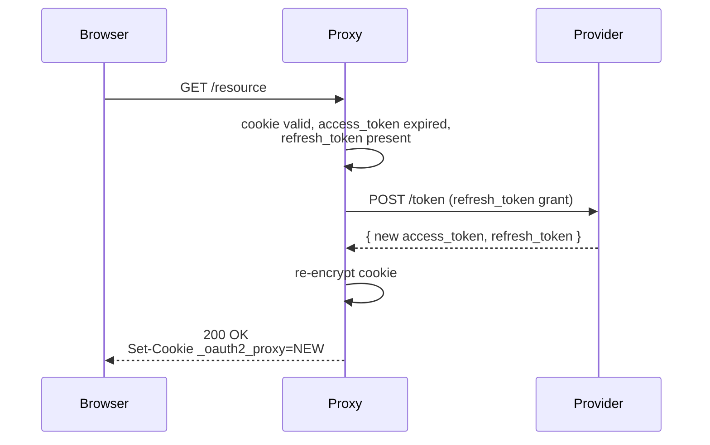
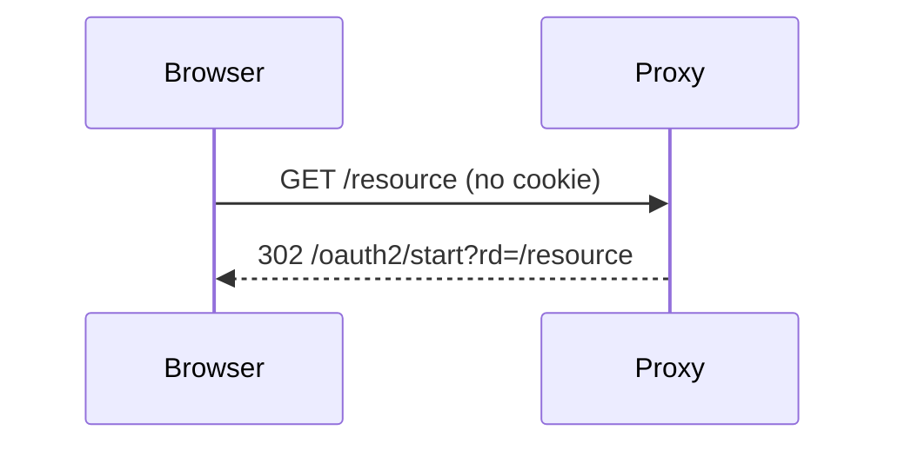
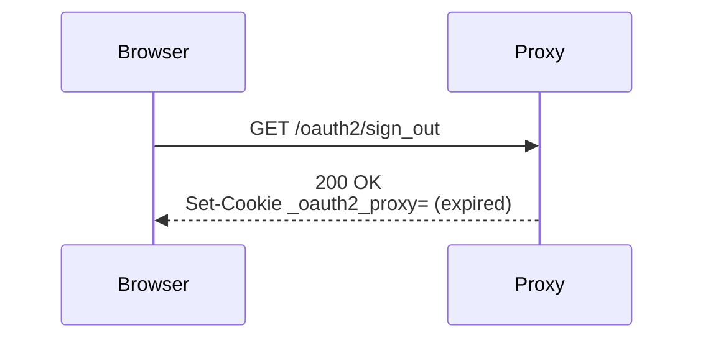
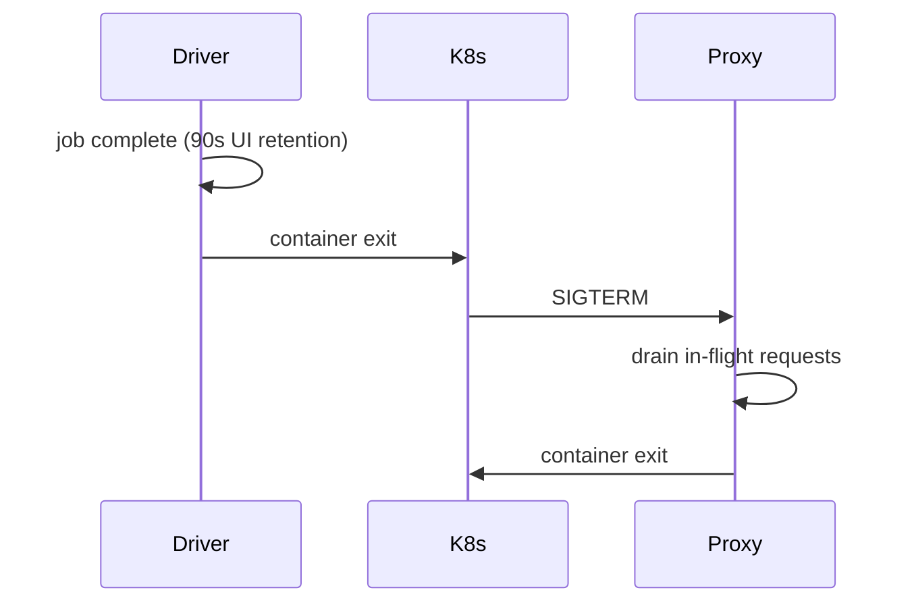

# Runtime Flow

What actually happens at runtime, from pod start until a user views the Spark UI.

## Summary

oauth2-proxy is a stateless reverse proxy. The "session" lives entirely in an encrypted cookie on the user's browser. Spark UI never learns about OAuth; it sees plain HTTP from `127.0.0.1`.

### Startup

The OAuth sidecar boots before the driver. It reads `COOKIE_SECRET` and `CLIENT_SECRET` from the environment, fetches the OIDC provider's discovery document and JWKS signing keys (unless `skipProviderDiscovery=true`), and begins listening on `0.0.0.0:4180`. Kubernetes confirms readiness via a `GET /ping` liveness probe, then starts the driver container. A fresh 16-byte cookie secret is generated per submission; the client secret is either inlined or sourced from a K8s secret via `clientSecretK8s`.

### Redirect dance

When a user first navigates to the Spark UI (e.g. `https://spark-ui.example.com/jobs/`), the proxy intercepts the request and redirects the browser to `/oauth2/start`, preserving the original path. The proxy generates a PKCE code_challenge and a state token, stores the code_verifier and state in a CSRF cookie, and redirects the browser to the OIDC provider's `/authorize` endpoint. The user authenticates with the provider, which redirects back to `/oauth2/callback` with an authorization code. The proxy validates the state, exchanges the code for tokens (access, ID, refresh) via a server-to-server call to the provider's `/token` endpoint, verifies the ID token's JWT signature against the cached JWKS keys (checking `iss`, `aud`, `exp`, `email_verified`), encrypts the entire session into a cookie (AES-CFB with the cookie secret), and redirects the browser to the original URL. The CSRF cookie is cleared. There is no server-side session store — the encrypted cookie is the complete session.

### Steady state

Every subsequent request carries the session cookie. The proxy decrypts and validates it (expiry, email domain), then forwards the request to the Spark UI on `127.0.0.1:4040` with injected headers (`X-Forwarded-User`, `X-Forwarded-Email`, `Authorization: Bearer <id_token>`). Spark UI ignores these headers and processes the request normally. The proxy is in the data path for every request — it does not authenticate once and step aside. When the cookie's `Max-Age` expires, the browser stops sending it and the redirect dance repeats; most OIDC providers skip the password prompt if their own session is still active (SSO). Token refresh can happen silently if `--cookie-refresh` is configured, but this is not enabled by default. Logout (`/oauth2/sign_out`) clears only the local cookie; the provider's session is unaffected. When the Spark job finishes, the pod terminates and the auth surface disappears with it.

## Detailed phases

### Phase 0: Pod startup

The OAuth init container boots before the main driver container.

- `OAUTH2_PROXY_COOKIE_SECRET` is generated fresh per submission (16 random bytes, hex-encoded). See [`generateCookieSecret`](../../src/main/scala/org/apache/spark/deploy/armada/submit/OAuthSidecarBuilder.scala#L324).
- `OAUTH2_PROXY_CLIENT_SECRET` is sourced inline or via `secretKeyRef` from the K8s secret named in `clientSecretK8s`.
- Discovery + JWKS fetch are skipped if `skipProviderDiscovery=true`; you must supply explicit endpoints instead.
- Liveness probe is `GET /ping` every 10s, fails after 3.

**Failure modes:** OIDC provider unreachable, requests fail with 500 until reachable. Bad client secret, surfaces only on first token exchange. Cookie secret malformed, pod fails to start.

### Phase 1: First request (cold session)

User opens `https://spark-ui.example.com/jobs/` with no cookie.

The CSRF cookie holds the `state` token and PKCE `code_verifier`. PKCE means the verifier never crosses the network in plaintext, only its SHA-256 hash. The original path is preserved in `rd=` for redirect after auth.

### Phase 2: User authenticates with OIDC provider

Outside the cluster.

### Phase 3: Token exchange

Where the proxy obtains the user's identity.

What this phase establishes:

1. **The session cookie is the entire session.** Contains `email`, `user`, `access_token`, `refresh_token`, `id_token`, `expires_on`. No server-side store. oauth2-proxy is stateless.
2. **Cookie is encrypted, not just signed** (AES-CFB). Tamper-proof; browser cannot read it.
3. CSRF cookie is destroyed; user is redirected to the original URL.

### Phase 4: Authenticated request

- **Cookie validation = decryption.** That's the entire runtime check on every request. No call to the OIDC provider.
- **Spark UI is unaware of OAuth.** It sees a normal request from `localhost`. It ignores the injected headers.
- **Headers injected:** `X-Forwarded-User`, `X-Forwarded-Email`, `Authorization: Bearer <id_token>` (because of `--pass-authorization-header`), `X-Forwarded-Preferred-Username`, optionally `X-Forwarded-Access-Token` and original `Host`.

### Phase 5: Subsequent requests

Every page load, asset, and AJAX call repeats Phase 4. oauth2-proxy is in the data path for every byte; it does not authenticate-once-and-step-aside.

### Phase 6: Token refresh (silent renewal)

OIDC access tokens are short-lived (e.g., 1h); cookies last longer (default 168h). When access tokens expire, oauth2-proxy *can* silently refresh, but only if `--cookie-refresh` is configured.

**The defaults do not enable this.** Without it, access tokens go stale while the cookie is still valid; the cookie may keep working until `cookie_expire` is reached, at which point the user goes through Phase 1 again.

### Phase 7: Cookie expiry

When `Max-Age` passes, the browser stops sending the cookie. From the proxy's perspective this is identical to a cold session.

Most OIDC providers will skip the password prompt if their own session is still valid (SSO), so this is often invisible to the user.

### Phase 8: Logout

`/oauth2/sign_out` clears the local cookie only. The provider's session is **not** terminated unless `--end-session-endpoint` is configured (not surfaced as a Spark config key). Spark UI doesn't expose a logout button anyway.

### Phase 9: Pod termination

Auth surface dies with the pod. Browser cookies persist client-side but have nothing to authenticate to.
